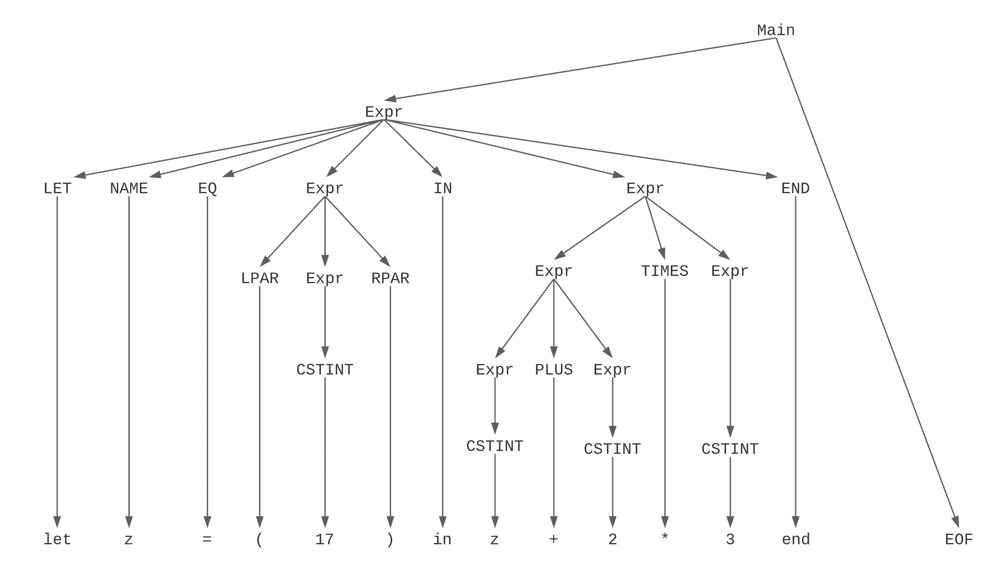

# Assignment 3 - General feedback

## 3.3

Notice that the assignment says “rightmost derivation”. This is important for what order you expand your expressions.

## 3.4

Most trees look really good! Example tree:


## 3.5

Many good examples, but many groups also forgot to include output of running the examples. Please include the output as text or as a screenshot.

## 3.6

Many different and correct solutions, if you want to challenge yourselves, then make these functions as concise as possible.

## 3.7 - Important: Operator precedence

Good solutions, seems that most people have understood how to modify the lexer and parser which is really good. If you still have troubles understanding it or couldn’t solve it, don’t hesitate to reach out or ask in the exercise session, this is really important for the course and exam!

What many overlooked was shift/reduce errors outputted by fsyacc:

```shell
> fsyacc --module ExprPar ExprPar.fsy
computing first function...        time: 00:00:00.0463727
building kernels...        time: 00:00:00.0177677
building kernel table...        time: 00:00:00.0057814
computing lookahead relations.................................        time: 00:00:00.0156002
building lookahead table...        time: 00:00:00.0045920
building action table...        shift/reduce error at state 23 on terminal PLUS between {[explicit left 9998] shift(25)} and {noprec reduce(Expr:'IF' Expr 'THEN' Expr 'ELSE' Expr)} - assuming the former because we prefer shift when unable to compare precedences
```

These errors show up because the precedence- and associativity-rules are not described correctly, making the grammar ambiguous. Fsyacc will just pick something to make it work anyways, but this is not always what we want. The TA’s last year wrote a good explanation of why and how we describe this in the fsy file:

### Precedence

Precedence tells us which operator should be parsed and evaluated first. For instance, `MUL` has a higher precedence than `ADD` to make sure that `a + b * c` is interpreted as `a + (b * c)`.

The ternary conditional should have the lowest precedence of the operators of this small language. This is to make sure that `if 1 then 2 else 3 + 4` is not parsed as `Prim ("+", If (CstI 1, CstI 2, CstI 3), CstI 4)` but rather `If (CstI 1, CstI 2, Prim ("+", CstI 3, CstI 4))`.

(You can see how c++ deals with precedence here: <https://en.cppreference.com/w/cpp/language/operator_precedence>)

### Why don't we need precedence rules for Let-bindings then ??

In the language we are building all let-bindings ends with an "end" keyword. So the entire expression is encapsulated between "let" and "end" terminal symbols. This effectively works as parentheses, so there is no reason to add precedence.

### Associativity

Associativity describes whether the operators are parsed left-to-right, right-to-left or not at all (?). Arithmetic operators are usually left associative, to make sure that `a * b * c` is interpreted as `(a * b) * c`.

Some operators don't associate with itself at all. This includes the `<` operator in many languages. You are not allowed to write `a < b < c`, so these operators are flagged as non-associative (`%nonassoc`). In other cases, it is simply not syntactically possible to chain together a sequence of the operator so these are also not associative.

If you chose to implement ternary statements using keywords `?` and `:`, you would probably need right-associativity such that `a ? b : c ? d : e` becomes `a ? b : (c ? d : e)`. If you went with `if then else` then associativity actually won't matter at all as you can't express it as a sequence due to the `if` keyword. So we should probably just pick `%nonassoc`.

Precedence rules for `? :` might look like:

```fsharp
%right QMARK COLON      /* lowest precedence  */
%left MINUS PLUS
%left TIMES             /* highest precedence */
```

And for `if then else`:

```fsharp
%nonassoc IF THEN ELSE  /* lowest precedence  */
%left MINUS PLUS
%left TIMES             /* highest precedence */
```
